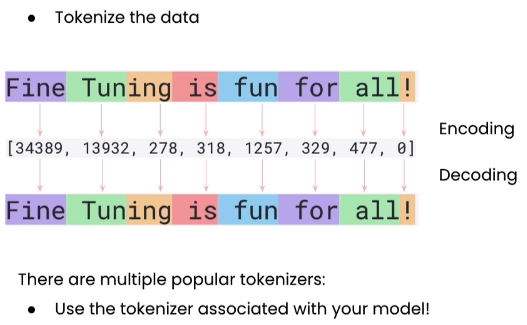

# 40K-Tokenizer

<p align="center">
  
</p>

## Table of Contents

- [Introduction](#introduction)
- [Features](#features)
- [Installation](#installation)
- [Acknowledgements](#acknowledgements)

## Introduction

40K-Tokenizer is a simple project I created to understand the concepts of this amazing tool. Nowadays, we have large language models (LLMs) at our disposal, but one of the first steps before training is to tokenize the data. I trained this tokenizer using three books from the Warhammer 40k universe, the Eisenhorn trilogy. Then, I created a simple web app similar to tiktokenizer vercel, which you can find [HERE](https://tiktokenizer.vercel.app/).

Additionally, I included tokenizers for GPT-4o, GPT-3.5, and GPT-2. Note that we are not dealing with Sentencepiece, a tokenizer commonly used by many open-source models.

## Features

- Tokenize text using multiple models: GPT-2, GPT-3.5-Turbo, GPT-4o, and 40K-Tokenizer.
- Interactive web interface for inputting text and viewing tokens.
- Display token count and encoded tokens.
- Highlight tokens with random colors for easy differentiation.

## Installation

### Prerequisites

- Python 3.11+
- Poetry

### Steps

1. **Clone the repository**:

    ```sh
    git clone https://github.com/yourusername/tiktokenizer.git
    cd tiktokenizer
    ```

2. **Install Poetry** (if not already installed):

    Refer [HERE](https://python-poetry.org/docs/#installation) in order install poetry

3. **Install dependencies** using Poetry:

    ```sh
    poetry install
    ```

4. **Activate the virtual environment**:

    ```sh
    poetry shell
    ```

5. **Run the application**:

    ```sh
    python app.py
    ```

    The application will be accessible in you local server.

## Acknowledgements

Thanks to [Andrej Karpathy](https://github.com/karpathy) for the [minbpe](https://github.com/karpathy/minbpe/tree/master) repo that i used a guide. 
